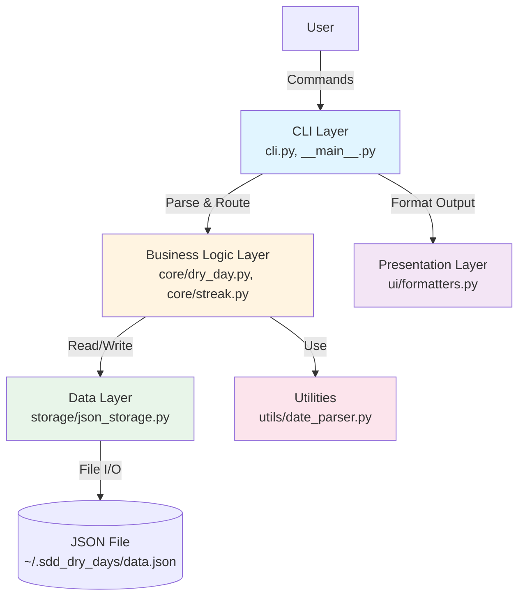
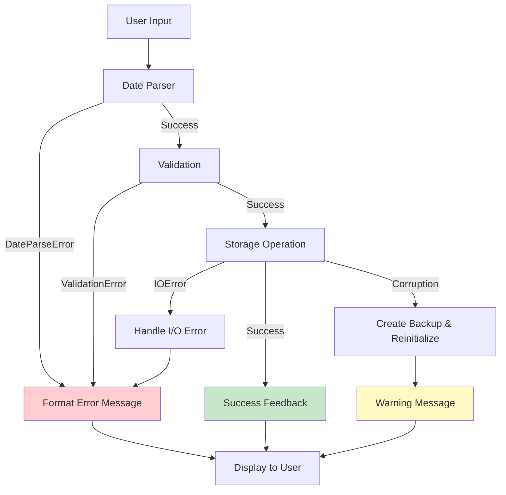

# Design Document: Add Dry Days

## Overview

The Add Dry Days feature implements the foundational data entry capability for the SDD Dry Days application. It provides a command-line interface for users to record alcohol-free days with minimal friction, supporting single-date entry (defaulting to today), specific date entry, and date range entry. The design follows a layered architecture with clear separation of concerns between CLI handling, business logic, data persistence, and user interface presentation.

This feature establishes the core data model and storage infrastructure that will be used by all other features (calendar view, goals, statistics).

## Steering Document Alignment

### Technical Standards (tech.md)

**Language & Libraries:**
- Python 3.8+ as specified
- Standard library modules: `datetime`, `json`, `pathlib`, `argparse`
- Rich library for colorful console output
- pytest for testing framework

**Architecture Patterns:**
- Separation of concerns with distinct layers (CLI, Business Logic, Storage, Presentation)
- Repository pattern for storage abstraction (enables JSON → MongoDB migration)
- Data model abstraction to keep models independent of storage backend

**Performance Requirements:**
- Startup time < 1 second (minimize imports, lazy loading where possible)
- Response time < 200ms for add operations
- Efficient handling of 5+ years of daily entries

### Project Structure (structure.md)

**Directory Organization:**
```
src/sdd_dry_days/
├── __init__.py
├── __main__.py              # Entry point for CLI
├── cli.py                   # Command-line interface logic
├── core/
│   ├── __init__.py
│   ├── dry_day.py          # DryDay model and business logic
│   └── streak.py           # Streak calculation logic
├── storage/
│   ├── __init__.py
│   ├── base.py             # Abstract Storage interface
│   └── json_storage.py     # JSON file implementation
├── ui/
│   ├── __init__.py
│   └── formatters.py       # Rich-based output formatting
└── utils/
    ├── __init__.py
    └── date_parser.py      # Date parsing utilities
```

**Coding Standards:**
- PEP 8 compliance (Black formatting, 88 char line length)
- Type hints for public APIs
- Google-style docstrings
- Descriptive function/class names using snake_case/PascalCase

**Testing Philosophy:**
- Test-driven development approach
- Unit tests for core logic (date parsing, validation, streak calculation)
- Integration tests for storage operations
- pytest fixtures for test data
- Target >80% code coverage

## Code Reuse Analysis

**Status:** This is the first feature implementation in a new project.

**Foundation Being Created:**
- `DryDay` data model (will be used by all features)
- `Storage` abstraction (will be used by all features)
- `JsonStorage` implementation (will be used by all features)
- Date parsing utilities (will be reused in future date-related features)
- Rich formatting patterns (will be extended by calendar, stats features)
- CLI argument parsing structure (will be extended with more commands)

**Future Reuse Opportunities:**
- Other features will extend the CLI with new subcommands
- Calendar view will use `DryDay` model and `Storage` interface
- Goal tracking will use `DryDay` model for progress calculation
- Statistics will use `Storage` interface to query dry days data

### Integration Points

**Storage System:**
- JSON file at `~/.sdd_dry_days/data.json`
- Atomic write operations to prevent corruption
- Schema versioning for future migrations

**Future Integration:**
- Calendar view will read dry days via `Storage` interface
- Goal tracking will query dry days for streak/count calculations
- Statistics will aggregate dry days data for reporting

## Architecture

The design follows a four-layer architecture ensuring clear separation of concerns:



### Layer Responsibilities

1. **CLI Layer** (`cli.py`, `__main__.py`)
   - Parse command-line arguments using argparse
   - Route commands to appropriate business logic
   - Coordinate between business logic and presentation layers
   - Handle top-level error catching and reporting

2. **Business Logic Layer** (`core/`)
   - `dry_day.py`: DryDay model, validation, and operations
   - `streak.py`: Streak calculation logic
   - Core domain logic independent of storage or presentation
   - Input validation and business rule enforcement

3. **Data Layer** (`storage/`)
   - `base.py`: Abstract Storage interface
   - `json_storage.py`: JSON file storage implementation
   - Handle all persistence operations
   - Ensure data integrity (atomic writes, validation)

4. **Presentation Layer** (`ui/`)
   - `formatters.py`: Rich-based output formatting
   - Colorful, encouraging user feedback
   - Consistent message formatting across the application

5. **Utilities** (`utils/`)
   - `date_parser.py`: Date parsing and validation
   - Shared helper functions

## Components and Interfaces

### Component 1: DryDay Model

**Purpose:** Represents a single dry day entry with date, metadata, and validation logic.

**File:** `src/sdd_dry_days/core/dry_day.py`

**Interface:**
```python
from dataclasses import dataclass
from datetime import datetime
from typing import Optional

@dataclass
class DryDay:
    """Represents a single dry day entry."""

    date: datetime  # Date of the dry day (date only, no time)
    note: str = ""  # Optional note/context
    added_at: datetime = None  # Timestamp when entry was created
    is_planned: bool = False  # True if future date, False if past/today

    def __post_init__(self):
        """Initialize added_at and is_planned if not set."""
        if self.added_at is None:
            self.added_at = datetime.now()
        # Normalize date to start of day (remove time component)
        self.date = self.date.replace(hour=0, minute=0, second=0, microsecond=0)

    def to_dict(self) -> dict:
        """Convert to dictionary for JSON serialization."""
        return {
            "date": self.date.strftime("%Y-%m-%d"),
            "note": self.note,
            "added_at": self.added_at.isoformat(),
            "is_planned": self.is_planned
        }

    @classmethod
    def from_dict(cls, data: dict) -> "DryDay":
        """Create DryDay from dictionary (JSON deserialization)."""
        return cls(
            date=datetime.fromisoformat(data["date"]),
            note=data.get("note", ""),
            added_at=datetime.fromisoformat(data["added_at"]),
            is_planned=data.get("is_planned", False)
        )

    def is_duplicate(self, other: "DryDay") -> bool:
        """Check if this dry day has the same date as another."""
        return self.date.date() == other.date.date()
```

**Dependencies:**
- Python standard library: `datetime`, `dataclasses`, `typing`

**Reuses:** None (foundational component)

---

### Component 2: Storage Interface (Abstract Base)

**Purpose:** Define contract for storage operations, enabling multiple implementations (JSON, MongoDB, etc.)

**File:** `src/sdd_dry_days/storage/base.py`

**Interface:**
```python
from abc import ABC, abstractmethod
from typing import List, Optional
from datetime import datetime
from ..core.dry_day import DryDay

class Storage(ABC):
    """Abstract interface for dry days storage."""

    @abstractmethod
    def add_dry_day(self, dry_day: DryDay) -> bool:
        """Add a dry day. Returns True if added, False if already exists."""
        pass

    @abstractmethod
    def get_dry_day(self, date: datetime) -> Optional[DryDay]:
        """Get a dry day by date. Returns None if not found."""
        pass

    @abstractmethod
    def get_all_dry_days(self) -> List[DryDay]:
        """Get all dry days, sorted by date."""
        pass

    @abstractmethod
    def update_dry_day(self, dry_day: DryDay) -> bool:
        """Update an existing dry day. Returns True if updated, False if not found."""
        pass

    @abstractmethod
    def exists(self, date: datetime) -> bool:
        """Check if a dry day exists for the given date."""
        pass

    @abstractmethod
    def get_dry_days_in_range(self, start: datetime, end: datetime) -> List[DryDay]:
        """Get dry days within a date range (inclusive)."""
        pass
```

**Dependencies:**
- `DryDay` model from core layer

**Reuses:** None (foundational component)

---

### Component 3: JSON Storage Implementation

**Purpose:** Concrete implementation of Storage interface using JSON file persistence.

**File:** `src/sdd_dry_days/storage/json_storage.py`

**Interface:**
```python
from pathlib import Path
import json
import tempfile
import shutil
from typing import List, Optional
from datetime import datetime
from .base import Storage
from ..core.dry_day import DryDay

class JsonStorage(Storage):
    """JSON file-based storage implementation."""

    DEFAULT_DATA_DIR = Path.home() / ".sdd_dry_days"
    DEFAULT_DATA_FILE = "data.json"
    SCHEMA_VERSION = "1.0"

    def __init__(self, data_dir: Optional[Path] = None):
        """Initialize JSON storage with data directory."""
        self.data_dir = data_dir or self.DEFAULT_DATA_DIR
        self.data_file = self.data_dir / self.DEFAULT_DATA_FILE
        self._ensure_data_directory()

    def _ensure_data_directory(self):
        """Create data directory if it doesn't exist."""
        if not self.data_dir.exists():
            self.data_dir.mkdir(mode=0o700, parents=True)

        if not self.data_file.exists():
            self._write_data({"dry_days": [], "version": self.SCHEMA_VERSION})

    def _read_data(self) -> dict:
        """Read and validate JSON data file."""
        try:
            with self.data_file.open('r') as f:
                data = json.load(f)

            # Validate schema
            if "dry_days" not in data:
                raise ValueError("Invalid data format: missing 'dry_days' key")

            return data
        except (json.JSONDecodeError, ValueError) as e:
            # Handle corrupted file
            backup_file = self.data_dir / f"data.json.backup.{datetime.now().strftime('%Y%m%d_%H%M%S')}"
            shutil.copy(self.data_file, backup_file)
            # Initialize new file
            new_data = {"dry_days": [], "version": self.SCHEMA_VERSION}
            self._write_data(new_data)
            return new_data

    def _write_data(self, data: dict):
        """Write data to JSON file atomically."""
        # Write to temp file first
        temp_file = tempfile.NamedTemporaryFile(
            mode='w',
            dir=self.data_dir,
            delete=False,
            suffix='.tmp'
        )

        try:
            json.dump(data, temp_file, indent=2)
            temp_file.close()

            # Set permissions (user read/write only)
            Path(temp_file.name).chmod(0o600)

            # Atomic rename
            shutil.move(temp_file.name, self.data_file)
        except Exception as e:
            # Clean up temp file on error
            Path(temp_file.name).unlink(missing_ok=True)
            raise

    def add_dry_day(self, dry_day: DryDay) -> bool:
        """Add a dry day. Returns True if added, False if already exists."""
        data = self._read_data()

        # Check for duplicates
        for existing in data["dry_days"]:
            if existing["date"] == dry_day.date.strftime("%Y-%m-%d"):
                return False  # Already exists

        # Add new entry
        data["dry_days"].append(dry_day.to_dict())

        # Sort by date
        data["dry_days"].sort(key=lambda x: x["date"])

        self._write_data(data)
        return True

    def get_dry_day(self, date: datetime) -> Optional[DryDay]:
        """Get a dry day by date."""
        data = self._read_data()
        date_str = date.strftime("%Y-%m-%d")

        for entry in data["dry_days"]:
            if entry["date"] == date_str:
                return DryDay.from_dict(entry)

        return None

    def get_all_dry_days(self) -> List[DryDay]:
        """Get all dry days, sorted by date."""
        data = self._read_data()
        return [DryDay.from_dict(entry) for entry in data["dry_days"]]

    def update_dry_day(self, dry_day: DryDay) -> bool:
        """Update an existing dry day."""
        data = self._read_data()
        date_str = dry_day.date.strftime("%Y-%m-%d")

        for i, entry in enumerate(data["dry_days"]):
            if entry["date"] == date_str:
                data["dry_days"][i] = dry_day.to_dict()
                self._write_data(data)
                return True

        return False

    def exists(self, date: datetime) -> bool:
        """Check if a dry day exists."""
        return self.get_dry_day(date) is not None

    def get_dry_days_in_range(self, start: datetime, end: datetime) -> List[DryDay]:
        """Get dry days within date range."""
        all_days = self.get_all_dry_days()
        return [
            day for day in all_days
            if start.date() <= day.date.date() <= end.date()
        ]
```

**Dependencies:**
- `Storage` interface from `storage.base`
- `DryDay` model from core layer
- Python standard library: `pathlib`, `json`, `tempfile`, `shutil`

**Reuses:** `Storage` interface (implements)

---

### Component 4: Date Parser Utility

**Purpose:** Parse dates from various formats and handle validation.

**File:** `src/sdd_dry_days/utils/date_parser.py`

**Interface:**
```python
from datetime import datetime
from typing import Optional, List
import re

class DateParseError(Exception):
    """Raised when date parsing fails."""
    pass

class DateParser:
    """Utility for parsing dates in various formats."""

    # Supported date formats in order of preference
    FORMATS = [
        "%Y-%m-%d",          # ISO: 2026-03-06
        "%m/%d/%Y",          # US: 03/06/2026
        "%d-%m-%Y",          # EU: 06-03-2026
        "%d/%m/%Y",          # EU: 06/03/2026
        "%Y%m%d",            # Compact: 20260306
    ]

    @classmethod
    def parse(cls, date_str: str) -> datetime:
        """Parse a date string in various formats.

        Args:
            date_str: Date string to parse

        Returns:
            datetime object

        Raises:
            DateParseError: If date cannot be parsed
        """
        date_str = date_str.strip()

        # Try each format
        for fmt in cls.FORMATS:
            try:
                return datetime.strptime(date_str, fmt)
            except ValueError:
                continue

        # If all formats fail, raise error with examples
        raise DateParseError(
            f"Invalid date format: '{date_str}'. "
            f"Supported formats: YYYY-MM-DD, MM/DD/YYYY, DD-MM-YYYY, DD/MM/YYYY"
        )

    @classmethod
    def validate_leap_year(cls, date: datetime) -> bool:
        """Validate February 29 in non-leap years."""
        if date.month == 2 and date.day == 29:
            year = date.year
            is_leap = (year % 4 == 0 and year % 100 != 0) or (year % 400 == 0)
            if not is_leap:
                raise DateParseError(
                    f"February 29 does not exist in {year} (not a leap year)"
                )
        return True

    @classmethod
    def generate_date_range(cls, start: datetime, end: datetime) -> List[datetime]:
        """Generate list of dates between start and end (inclusive).

        Args:
            start: Start date
            end: End date

        Returns:
            List of datetime objects

        Raises:
            DateParseError: If end is before start
        """
        if end < start:
            raise DateParseError(
                f"End date ({end.strftime('%Y-%m-%d')}) "
                f"cannot be before start date ({start.strftime('%Y-%m-%d')})"
            )

        from datetime import timedelta
        dates = []
        current = start

        while current <= end:
            dates.append(current)
            current += timedelta(days=1)

        return dates
```

**Dependencies:**
- Python standard library: `datetime`, `re`

**Reuses:** None (utility component)

---

### Component 5: Streak Calculator

**Purpose:** Calculate consecutive dry days streaks.

**File:** `src/sdd_dry_days/core/streak.py`

**Interface:**
```python
from datetime import datetime, timedelta
from typing import List
from .dry_day import DryDay

class StreakCalculator:
    """Calculate streaks of consecutive dry days."""

    @staticmethod
    def calculate_current_streak(dry_days: List[DryDay]) -> int:
        """Calculate current streak ending today.

        Args:
            dry_days: List of DryDay objects (sorted by date)

        Returns:
            Current streak count (0 if no current streak)
        """
        if not dry_days:
            return 0

        # Sort by date descending
        sorted_days = sorted(dry_days, key=lambda d: d.date, reverse=True)

        today = datetime.now().replace(hour=0, minute=0, second=0, microsecond=0)

        # Check if today is a dry day
        if sorted_days[0].date.date() != today.date():
            return 0

        streak = 1
        expected_date = today - timedelta(days=1)

        for dry_day in sorted_days[1:]:
            if dry_day.date.date() == expected_date.date():
                streak += 1
                expected_date -= timedelta(days=1)
            else:
                break

        return streak
```

**Dependencies:**
- `DryDay` model from core layer
- Python standard library: `datetime`

**Reuses:** `DryDay` model

---

### Component 6: Output Formatter

**Purpose:** Format output messages using Rich library for colorful, encouraging feedback.

**File:** `src/sdd_dry_days/ui/formatters.py`

**Interface:**
```python
from rich.console import Console
from rich.panel import Panel
from rich.text import Text
from datetime import datetime

class OutputFormatter:
    """Format output messages with colors and styling."""

    def __init__(self):
        self.console = Console()

    def success(self, message: str, date: datetime, streak: int = 0):
        """Display success message when dry day is added."""
        text = Text()
        text.append("✓ ", style="bold green")
        text.append(f"Dry day added: ", style="green")
        text.append(f"{date.strftime('%Y-%m-%d')}", style="bold cyan")

        if streak > 0:
            text.append(f"\n🔥 Current streak: ", style="yellow")
            text.append(f"{streak} day{'s' if streak != 1 else ''}", style="bold yellow")

        panel = Panel(text, border_style="green", expand=False)
        self.console.print(panel)

    def already_exists(self, date: datetime):
        """Display message when dry day already exists."""
        text = Text()
        text.append("ℹ ", style="bold blue")
        text.append(f"Dry day already recorded for ", style="blue")
        text.append(f"{date.strftime('%Y-%m-%d')}", style="bold cyan")

        panel = Panel(text, border_style="blue", expand=False)
        self.console.print(panel)

    def range_summary(self, added: int, skipped: int, total: int):
        """Display summary for date range addition."""
        text = Text()
        text.append("✓ ", style="bold green")
        text.append(f"Added {added}/{total} dry days", style="green")

        if skipped > 0:
            text.append(f"\nℹ {skipped} already existed", style="blue")

        panel = Panel(text, border_style="green", expand=False)
        self.console.print(panel)

    def error(self, message: str, details: str = ""):
        """Display error message."""
        text = Text()
        text.append("✗ ", style="bold red")
        text.append(message, style="red")

        if details:
            text.append(f"\n{details}", style="dim")

        panel = Panel(text, border_style="red", expand=False)
        self.console.print(panel)

    def confirm(self, message: str) -> bool:
        """Ask for user confirmation."""
        return self.console.input(f"[yellow]{message} (y/N): [/yellow]").lower() == 'y'
```

**Dependencies:**
- Rich library: `Console`, `Panel`, `Text`
- Python standard library: `datetime`

**Reuses:** None (presentation layer component)

---

### Component 7: CLI Handler

**Purpose:** Parse command-line arguments and orchestrate the add workflow.

**File:** `src/sdd_dry_days/cli.py`

**Interface:**
```python
import argparse
from datetime import datetime
from typing import List
from .core.dry_day import DryDay
from .core.streak import StreakCalculator
from .storage.json_storage import JsonStorage
from .utils.date_parser import DateParser, DateParseError
from .ui.formatters import OutputFormatter

class CLI:
    """Command-line interface handler."""

    def __init__(self):
        self.storage = JsonStorage()
        self.formatter = OutputFormatter()
        self.parser = self._create_parser()

    def _create_parser(self) -> argparse.ArgumentParser:
        """Create argument parser."""
        parser = argparse.ArgumentParser(
            prog="sdd",
            description="SDD Dry Days - Track your alcohol-free days"
        )

        subparsers = parser.add_subparsers(dest="command", help="Commands")

        # Add command
        add_parser = subparsers.add_parser("add", help="Add dry day(s)")
        add_parser.add_argument(
            "date",
            nargs="?",
            help="Date to add (defaults to today). Format: YYYY-MM-DD, MM/DD/YYYY, etc."
        )
        add_parser.add_argument(
            "--note", "-n",
            help="Optional note for the dry day"
        )
        add_parser.add_argument(
            "--range", "-r",
            nargs=2,
            metavar=("START", "END"),
            help="Add date range (inclusive)"
        )

        return parser

    def run(self, args: List[str] = None):
        """Run CLI with provided arguments."""
        parsed_args = self.parser.parse_args(args)

        if parsed_args.command == "add":
            self._handle_add(parsed_args)
        else:
            self.parser.print_help()

    def _handle_add(self, args):
        """Handle add command."""
        try:
            if args.range:
                self._add_date_range(args.range[0], args.range[1])
            elif args.date:
                self._add_single_date(args.date, args.note)
            else:
                self._add_today(args.note)
        except DateParseError as e:
            self.formatter.error("Date parsing error", str(e))
        except Exception as e:
            self.formatter.error("Unexpected error", str(e))

    def _add_today(self, note: str = ""):
        """Add today as a dry day."""
        today = datetime.now()
        dry_day = DryDay(date=today, note=note or "", is_planned=False)

        if self.storage.add_dry_day(dry_day):
            all_days = self.storage.get_all_dry_days()
            streak = StreakCalculator.calculate_current_streak(all_days)
            self.formatter.success("Today added", today, streak)
        else:
            self.formatter.already_exists(today)

    def _add_single_date(self, date_str: str, note: str = ""):
        """Add a specific date."""
        date = DateParser.parse(date_str)
        DateParser.validate_leap_year(date)

        is_future = date.date() > datetime.now().date()
        dry_day = DryDay(date=date, note=note or "", is_planned=is_future)

        if self.storage.add_dry_day(dry_day):
            all_days = self.storage.get_all_dry_days()
            streak = StreakCalculator.calculate_current_streak(all_days)
            self.formatter.success("Dry day added", date, streak)
        else:
            self.formatter.already_exists(date)

    def _add_date_range(self, start_str: str, end_str: str):
        """Add a range of dates."""
        start = DateParser.parse(start_str)
        end = DateParser.parse(end_str)

        dates = DateParser.generate_date_range(start, end)

        # Confirm if large range
        if len(dates) > 90:
            if not self.formatter.confirm(f"Add {len(dates)} dates?"):
                return

        added = 0
        skipped = 0

        for date in dates:
            is_future = date.date() > datetime.now().date()
            dry_day = DryDay(date=date, note="", is_planned=is_future)

            if self.storage.add_dry_day(dry_day):
                added += 1
            else:
                skipped += 1

        self.formatter.range_summary(added, skipped, len(dates))
```

**Dependencies:**
- All components above
- Python standard library: `argparse`, `datetime`

**Reuses:** All other components (orchestrates them)

---

### Component 8: Entry Point

**Purpose:** Main entry point for the application.

**File:** `src/sdd_dry_days/__main__.py`

**Interface:**
```python
"""Main entry point for SDD Dry Days CLI."""

from .cli import CLI

def main():
    """Main entry point."""
    cli = CLI()
    cli.run()

if __name__ == "__main__":
    main()
```

**Dependencies:**
- `CLI` from `cli.py`

**Reuses:** `CLI` component

## Data Models

### DryDay Data Model

**Storage Format (JSON):**
```json
{
  "date": "2026-03-06",
  "note": "First dry day!",
  "added_at": "2026-03-06T14:30:00",
  "is_planned": false
}
```

**Python Representation:**
```python
@dataclass
class DryDay:
    date: datetime          # Normalized to start of day
    note: str = ""         # Optional note
    added_at: datetime     # Creation timestamp
    is_planned: bool       # Future date flag
```

**Field Descriptions:**
- `date`: The actual dry day date (time component zeroed out)
- `note`: Optional user-provided context or note
- `added_at`: Timestamp when the entry was created (for audit trail)
- `is_planned`: True if date is in the future (for future features)

### Data File Structure

**File Location:** `~/.sdd_dry_days/data.json`

**Schema:**
```json
{
  "version": "1.0",
  "dry_days": [
    {
      "date": "2026-03-01",
      "note": "",
      "added_at": "2026-03-01T10:00:00",
      "is_planned": false
    },
    {
      "date": "2026-03-02",
      "note": "Feeling great!",
      "added_at": "2026-03-02T09:30:00",
      "is_planned": false
    }
  ]
}
```

**Schema Evolution:**
- `version` field enables future migrations
- When structure changes, update version and add migration logic
- Backward compatibility maintained where possible

## Error Handling

### Error Scenarios

#### 1. Invalid Date Format
- **Scenario:** User provides unparseable date string
- **Handling:** `DateParser.parse()` raises `DateParseError`
- **User Impact:** Error message with supported format examples
- **Example:** `"Invalid date format: '06-03'. Supported formats: YYYY-MM-DD, MM/DD/YYYY..."`

#### 2. Leap Year Validation
- **Scenario:** User tries to add February 29 in non-leap year
- **Handling:** `DateParser.validate_leap_year()` raises `DateParseError`
- **User Impact:** Clear error message explaining the issue
- **Example:** `"February 29 does not exist in 2025 (not a leap year)"`

#### 3. Invalid Date Range
- **Scenario:** End date is before start date
- **Handling:** `DateParser.generate_date_range()` raises `DateParseError`
- **User Impact:** Error message showing the invalid range
- **Example:** `"End date (2026-03-01) cannot be before start date (2026-03-05)"`

#### 4. File Permission Error
- **Scenario:** Cannot create data directory or file
- **Handling:** OS error caught in `JsonStorage._ensure_data_directory()`
- **User Impact:** Error message with permission details
- **Example:** `"Cannot create data directory: Permission denied. Please check ~/.sdd_dry_days/"`

#### 5. Corrupted Data File
- **Scenario:** JSON file is malformed or corrupted
- **Handling:** `JsonStorage._read_data()` creates backup and reinitializes
- **User Impact:** Warning message about corruption and backup location
- **Example:** `"Data file corrupted. Backup created at ~/.sdd_dry_days/data.json.backup.20260306_143000"`

#### 6. Disk Full
- **Scenario:** No space available to write data
- **Handling:** OS error caught in `JsonStorage._write_data()`
- **User Impact:** Clear error message about disk space
- **Example:** `"Cannot save data: No space left on device"`

#### 7. Duplicate Date
- **Scenario:** User tries to add a date that already exists
- **Handling:** `JsonStorage.add_dry_day()` returns False (not an error)
- **User Impact:** Friendly informational message
- **Example:** `"ℹ Dry day already recorded for 2026-03-06"`

### Error Handling Strategy



## Testing Strategy

### Unit Testing

**Files to Test:**
- `tests/unit/test_dry_day.py`
- `tests/unit/test_date_parser.py`
- `tests/unit/test_streak.py`
- `tests/unit/test_formatters.py`

**Test Coverage:**
1. **DryDay Model:**
   - Test `to_dict()` and `from_dict()` serialization
   - Test `is_duplicate()` logic
   - Test `__post_init__()` date normalization
   - Test default values

2. **Date Parser:**
   - Test all supported date formats
   - Test invalid format error handling
   - Test leap year validation (valid and invalid)
   - Test date range generation
   - Test empty/malformed input

3. **Streak Calculator:**
   - Test current streak with consecutive dates
   - Test streak reset with gaps
   - Test empty list (0 streak)
   - Test today not included (0 streak)
   - Test single day streak

4. **Output Formatter:**
   - Test message formatting (not rendering)
   - Mock Rich Console for testing

**Example Test:**
```python
def test_date_parser_iso_format():
    """Test parsing ISO format dates."""
    result = DateParser.parse("2026-03-06")
    assert result.year == 2026
    assert result.month == 3
    assert result.day == 6

def test_streak_with_gap():
    """Test streak resets when there's a gap."""
    days = [
        DryDay(date=datetime(2026, 3, 1)),
        DryDay(date=datetime(2026, 3, 2)),
        # Gap on March 3
        DryDay(date=datetime(2026, 3, 4)),
        DryDay(date=datetime(2026, 3, 5)),
        DryDay(date=datetime(2026, 3, 6)),  # Today
    ]
    streak = StreakCalculator.calculate_current_streak(days)
    assert streak == 3  # Only counts 3/4, 3/5, 3/6
```

### Integration Testing

**Files to Test:**
- `tests/integration/test_storage.py`
- `tests/integration/test_cli.py`

**Test Coverage:**
1. **Storage Integration:**
   - Test with actual filesystem (temp directory)
   - Test data directory creation
   - Test file permission setting
   - Test atomic write operations
   - Test corrupted file recovery
   - Test concurrent write scenarios (if possible)

2. **CLI Integration:**
   - Test complete workflow: parse args → add → save → confirm
   - Test with various argument combinations
   - Test error propagation to user output
   - Mock storage for faster tests

**Example Test:**
```python
def test_json_storage_atomic_write(tmp_path):
    """Test that writes are atomic."""
    storage = JsonStorage(data_dir=tmp_path)
    dry_day = DryDay(date=datetime(2026, 3, 6))

    # Simulate crash during write by mocking
    with patch('shutil.move', side_effect=IOError("Simulated crash")):
        with pytest.raises(IOError):
            storage.add_dry_day(dry_day)

    # Original file should still be valid
    data = storage._read_data()
    assert data["dry_days"] == []  # Not corrupted

def test_cli_add_today(capsys):
    """Test CLI add command for today."""
    cli = CLI()
    cli.run(["add"])

    captured = capsys.readouterr()
    assert "Dry day added" in captured.out
    assert datetime.now().strftime("%Y-%m-%d") in captured.out
```

### Manual Testing Scenarios

**Test Plan:**
1. **Fresh Install:**
   - Delete `~/.sdd_dry_days/` directory
   - Run `sdd add`
   - Verify directory created with correct permissions
   - Verify data file created with valid JSON

2. **Date Format Variations:**
   - `sdd add 2026-03-06`
   - `sdd add 03/06/2026`
   - `sdd add 06-03-2026`
   - `sdd add invalid` (should show error)

3. **Duplicates:**
   - `sdd add` twice in same day
   - Should show "already recorded" message

4. **Date Ranges:**
   - `sdd add --range 2026-03-01 2026-03-05`
   - Verify all 5 dates added
   - Re-run same command
   - Should show "0 added, 5 skipped"

5. **Large Range Confirmation:**
   - `sdd add --range 2026-01-01 2026-06-01` (>90 days)
   - Should prompt for confirmation

6. **Notes:**
   - `sdd add --note "First dry day!"`
   - Verify note saved in JSON file

7. **Streak Display:**
   - Add consecutive days
   - Verify streak count increases
   - Add non-consecutive day
   - Verify streak resets

## Performance Considerations

### Startup Time Optimization
- Minimize imports in `__main__.py`
- Lazy load Rich components
- Avoid unnecessary file reads on startup
- Target: < 1 second to first output

### Response Time Optimization
- In-memory operations before I/O
- Single read + single write per operation
- Avoid redundant file operations
- Target: < 200ms feedback time

### Data Size Handling
- JSON file remains small (< 1 MB for 5 years)
- Linear scan acceptable for this size
- Sort once on write, not on every read
- No indexing needed at this scale

### Future Scalability
- Storage abstraction enables MongoDB migration
- Keep data models agnostic to storage backend
- Design for efficient querying when scaling

## Security Considerations

### File Permissions
```python
# Data directory: 700 (user only)
self.data_dir.mkdir(mode=0o700, parents=True)

# Data file: 600 (user read/write only)
Path(temp_file.name).chmod(0o600)
```

### Input Validation
- All date inputs validated through `DateParser`
- No shell command execution
- No eval() or exec() usage
- JSON parsing with built-in library (no arbitrary code execution)

### Data Privacy
- All data stored locally
- No network communication
- No telemetry or tracking
- No external API calls

### Atomic Writes
```python
# Write to temp file first
temp_file = tempfile.NamedTemporaryFile(...)
json.dump(data, temp_file)

# Atomic rename (OS-level guarantee)
shutil.move(temp_file.name, self.data_file)
```

## Implementation Sequence

This design enables the following implementation order (will be broken down in tasks.md):

1. **Foundation:**
   - Project structure setup (directories, `__init__.py` files)
   - Package configuration (`setup.py`, `requirements.txt`)

2. **Core Models:**
   - `DryDay` dataclass
   - Unit tests for `DryDay`

3. **Utilities:**
   - `DateParser` utility
   - Unit tests for `DateParser`

4. **Storage Layer:**
   - `Storage` abstract interface
   - `JsonStorage` implementation
   - Integration tests for storage

5. **Business Logic:**
   - `StreakCalculator`
   - Unit tests for streak calculation

6. **Presentation:**
   - `OutputFormatter` with Rich
   - Test message formatting

7. **CLI Layer:**
   - `CLI` class with argparse
   - `__main__.py` entry point
   - Integration tests for CLI

8. **Final Integration:**
   - End-to-end testing
   - Manual testing scenarios
   - Documentation

## Future Extensibility

This design supports future features:

1. **Undo/Remove Feature:**
   - Add `remove_dry_day()` to Storage interface
   - CLI command: `sdd remove <date>`

2. **Calendar View:**
   - Use `get_all_dry_days()` from Storage
   - Rich library has Calendar widget
   - Highlight dry days in calendar

3. **Goal Tracking:**
   - Extend `DryDay` model with goal references
   - Add `Goal` model and storage
   - Use streak calculation for goal progress

4. **Statistics:**
   - Use `get_dry_days_in_range()` for period stats
   - Calculate percentages, trends
   - Rich tables for display

5. **MongoDB Migration:**
   - Implement `MongoStorage(Storage)`
   - Data migration script from JSON
   - No changes to business logic layer

6. **Theming:**
   - Add theme configuration
   - Extend `OutputFormatter` with theme support
   - Rich supports custom themes

## Dependencies and Build

### Requirements

**Production (`requirements.txt`):**
```
rich>=13.0.0
```

**Development (`requirements-dev.txt`):**
```
pytest>=7.0.0
pytest-cov>=4.0.0
black>=23.0.0
flake8>=6.0.0
```

### Package Setup

**`setup.py`:**
```python
from setuptools import setup, find_packages

setup(
    name="sdd-dry-days",
    version="0.1.0",
    packages=find_packages(where="src"),
    package_dir={"": "src"},
    install_requires=[
        "rich>=13.0.0",
    ],
    entry_points={
        "console_scripts": [
            "sdd=sdd_dry_days.__main__:main",
        ],
    },
    python_requires=">=3.8",
)
```

### Installation

```bash
# Development installation
pip install -e .

# Install with dev dependencies
pip install -e ".[dev]"

# Run tests
pytest

# Check coverage
pytest --cov=src/sdd_dry_days --cov-report=html
```

## Conclusion

This design provides a solid foundation for the Add Dry Days feature with:
- Clear separation of concerns across layers
- Storage abstraction for future MongoDB migration
- Comprehensive error handling
- Rich, colorful user feedback
- Test-driven approach with >80% coverage target
- Extensibility for future features (calendar, goals, statistics)
- Security and data integrity guarantees

The implementation follows all steering document guidelines (product.md, tech.md, structure.md) and establishes patterns that will be reused throughout the application.