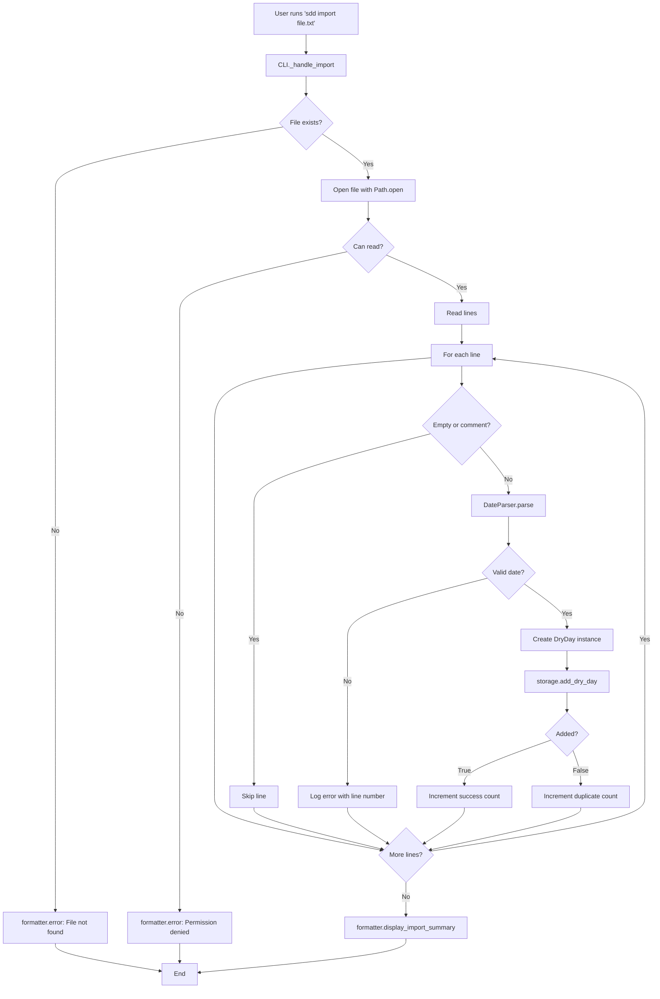

# Design Document: Import Dry Days

## Overview

The Import Dry Days feature adds a batch import capability to the SDD Dry Days CLI application. It enables users to import multiple dry day dates from a plain text file using a simple format (one date per line). The feature integrates seamlessly with existing components (DateParser, Storage, CLI, OutputFormatter) to maintain consistency with manual date entry while providing efficient bulk import functionality.

**Design Philosophy**: Keep it simple. No over-engineering. Leverage existing components. Focus on user experience with clear feedback.

## Steering Document Alignment

### Technical Standards (tech.md)
- **Python Standard Library**: Uses built-in file operations (`open()`, `pathlib.Path`) and no external dependencies beyond existing project libraries
- **Rich Library**: Leverages Rich `Panel` and `Table` for formatted summary display
- **Storage Abstraction**: Works through existing `Storage` interface for database-agnostic operation
- **Error Handling**: Follows project pattern of user-friendly messages (no stack traces)

### Project Structure (structure.md)
- **CLI Layer**: Adds `import` subcommand to existing argparse structure
- **Business Logic**: Reuses `DateParser`, `DryDay`, `StreakCalculator` from `core/`
- **Storage Layer**: Uses existing `Storage.add_dry_day()` method
- **Presentation Layer**: Extends `OutputFormatter` with import summary display
- **Four-Layer Architecture**: Maintained (CLI → Business Logic → Storage → Presentation)

## Code Reuse Analysis

### Existing Components to Leverage

1. **DateParser** (`src/sdd_dry_days/utils/date_parser.py`)
   - `DateParser.parse(date_str)`: Parse dates in all supported formats (ISO, US, EU, compact)
   - Already handles format detection and error raising (`DateParseError`)
   - No changes needed - use as-is

2. **Storage Interface** (`src/sdd_dry_days/storage/base.py`)
   - `Storage.add_dry_day(dry_day)`: Returns `True` if added, `False` if duplicate
   - Handles duplicate detection automatically
   - Atomic per-operation (each dry day saved independently)
   - No changes needed - use existing method

3. **DryDay Model** (`src/sdd_dry_days/core/dry_day.py`)
   - Create `DryDay` instances for each parsed date
   - Automatic date normalization to midnight
   - No changes needed - use existing constructor

4. **OutputFormatter** (`src/sdd_dry_days/ui/formatters.py`)
   - `formatter.error(title, message)`: Display error messages
   - `formatter.success()`: Display success messages (reusable pattern)
   - **EXTEND**: Add new method `display_import_summary()` for formatted summary panel

5. **CLI Structure** (`src/sdd_dry_days/cli.py`)
   - Existing argparse-based command routing (`_handle_add`, `_handle_view`)
   - **EXTEND**: Add `import` subparser and `_handle_import()` method
   - Follow existing exception handling pattern

### Integration Points

- **CLI → CLI**: Add `import` subcommand to `_create_parser()` alongside `add` and `view`
- **CLI → Utils**: Import and call `DateParser.parse()` for each line
- **CLI → Core**: Create `DryDay` instances from parsed dates
- **CLI → Storage**: Call `self.storage.add_dry_day()` for each dry day
- **CLI → UI**: Call `self.formatter.display_import_summary()` with results

### No New Dependencies Required
All functionality can be implemented using:
- Python standard library: `pathlib.Path`, `open()`, exception handling
- Existing project components listed above

## Architecture



## Components and Interfaces

### Component 1: CLI Import Handler
- **Purpose**: Orchestrate the import process (file reading, parsing, storage, feedback)
- **File**: `src/sdd_dry_days/cli.py` (extend existing)
- **New Method**: `_handle_import(self, args)`
- **Dependencies**: `pathlib.Path`, `DateParser`, `DryDay`, `self.storage`, `self.formatter`
- **Reuses**: Existing exception handling pattern from `_handle_add()`

**Method Signature**:
```python
def _handle_import(self, args):
    """Handle the import command by reading file and adding dry days.

    Reads a text file line-by-line, parses dates using DateParser,
    creates DryDay instances, and adds them via Storage. Tracks success,
    duplicates, and errors, then displays formatted summary.

    Args:
        args: Parsed arguments containing filepath.

    Process:
        1. Validate file path exists and is readable
        2. Read file line-by-line
        3. Skip empty lines and comments (lines starting with #)
        4. Parse each line as date using DateParser.parse()
        5. Create DryDay instance and call storage.add_dry_day()
        6. Track results: success_count, duplicate_count, error_list
        7. Display summary via formatter.display_import_summary()
    """
```

### Component 2: Import Summary Formatter
- **Purpose**: Display formatted import results with counts and error details
- **File**: `src/sdd_dry_days/ui/formatters.py` (extend existing `OutputFormatter`)
- **New Method**: `display_import_summary()`
- **Dependencies**: Rich `Panel`, `Table`, `Text`
- **Reuses**: Existing `OutputFormatter` patterns (Panel display, color usage)

**Method Signature**:
```python
def display_import_summary(self, total_lines: int, success_count: int,
                         duplicate_count: int, errors: List[Tuple[int, str, str]]):
    """Display formatted import summary with Rich Panel.

    Args:
        total_lines: Total number of lines processed from file
        success_count: Number of successfully added dry days
        duplicate_count: Number of duplicates skipped
        errors: List of tuples (line_number, line_content, error_message)

    Display:
        - Total lines processed
        - Successfully added count (green if > 0)
        - Duplicates skipped count
        - Errors encountered count
        - Detailed error list with line numbers (if any)
        - Success message (if success_count > 0)
    """
```

### Component 3: Argument Parser Extension
- **Purpose**: Add `import` subcommand to CLI argument parser
- **File**: `src/sdd_dry_days/cli.py` (extend `_create_parser()`)
- **Reuses**: Existing argparse subparser pattern from `add` and `view` commands

**Parser Addition**:
```python
# In _create_parser() method
import_parser = subparsers.add_parser(
    "import",
    help="Import dry days from a text file"
)
import_parser.add_argument(
    "filepath",
    type=str,
    help="Path to text file containing dates (one per line)"
)
```

## Data Models

### No New Data Models Required
The feature uses existing models:

**DryDay** (existing):
```python
@dataclass
class DryDay:
    date: datetime          # Parsed from file lines
    note: str = ""         # Empty for imported dates
    added_at: datetime     # Auto-set to import time
    is_planned: bool       # Auto-calculated based on date
```

### Data Structures Used

**Import Results Tracking** (internal to `_handle_import`):
```python
# Simple counters and list
total_lines: int = 0
success_count: int = 0
duplicate_count: int = 0
errors: List[Tuple[int, str, str]] = []  # (line_num, line_content, error_msg)
```

## Implementation Details

### File Reading Strategy
1. Use `pathlib.Path` for cross-platform path handling
2. Check `Path.exists()` before attempting to read (AC-3.1)
3. Use context manager (`with open()`) for automatic cleanup
4. Read line-by-line (no need for streaming - files expected to be small)
5. Strip whitespace from each line before processing

### Line Processing Logic
```python
for line_num, line in enumerate(file.readlines(), start=1):
    line = line.strip()

    # Skip empty lines (AC-1.2)
    if not line:
        continue

    # Skip comments (AC-4.3)
    if line.startswith('#'):
        continue

    total_lines += 1

    try:
        # Parse date (AC-1.3)
        parsed_date = DateParser.parse(line)

        # Create DryDay
        dry_day = DryDay(date=parsed_date, note="")

        # Add to storage (AC-2.1)
        if self.storage.add_dry_day(dry_day):
            success_count += 1
        else:
            duplicate_count += 1

    except DateParseError as e:
        # Log error but continue (AC-1.4)
        errors.append((line_num, line, str(e)))
```

### Error Handling Strategy

**File-Level Errors** (stop processing):
- File not found → Display error (AC-3.1), exit
- Permission denied → Display error (AC-3.2), exit
- Empty file → Display error (AC-3.3), exit

**Line-Level Errors** (continue processing):
- Invalid date format → Log error with line number (AC-3.4), continue to next line
- Duplicate date → Count as duplicate (not error), continue

**Exception Hierarchy**:
```python
try:
    # File operations
except FileNotFoundError:
    self.formatter.error("File not found", f"{filepath}. Please check the path and try again.")
except PermissionError:
    self.formatter.error("Permission denied", f"Cannot read file: {filepath}. Check file permissions.")
except Exception as e:
    self.formatter.error("Import failed", str(e))
```

### Performance Considerations

- **Sequential Processing**: Process dates one-by-one (AC-6.2, requirement for simplicity)
- **No Batching**: Call `storage.add_dry_day()` for each date (maintains existing atomic behavior)
- **Memory Efficiency**: Read file line-by-line (not loading entire file into memory)
- **Expected Performance**: 1000 dates in ~2-3 seconds (storage operations are fast)

### Progress Feedback

Simple approach (AC-6.3):
```python
print("Processing import file...")
# Process lines
# Display summary
```

No spinner or progress bar needed - processing is fast enough that simple feedback is sufficient.

## Error Handling

### Error Scenarios

1. **File Not Found**
   - **Handling**: Check `Path.exists()` before opening
   - **User Impact**: Error message with filepath, suggestion to check path

2. **Permission Denied**
   - **Handling**: Catch `PermissionError` when opening file
   - **User Impact**: Error message about permissions

3. **Empty File**
   - **Handling**: Check `len(lines) == 0` after reading
   - **User Impact**: Friendly message to add dates to file

4. **Invalid Date Format**
   - **Handling**: Catch `DateParseError` per line, continue processing
   - **User Impact**: Error listed in summary with line number

5. **Storage Failure**
   - **Handling**: Catch exceptions from `storage.add_dry_day()`
   - **User Impact**: Error in summary, but continue processing other dates

### Error Messages

All error messages follow existing formatter patterns:
- Use `formatter.error(title, message)` for file-level errors
- Include line numbers in summary for parse errors
- Provide actionable guidance (check path, check permissions, fix format)

## Testing Strategy

### Unit Testing

**Test File**: `tests/unit/test_import.py` (new file)

**Test Coverage**:
1. **DateParser Integration**:
   - Test that all supported formats work
   - Test error handling for invalid formats

2. **File Handling**:
   - Test file not found scenario
   - Test permission denied scenario
   - Test empty file scenario
   - Test file with only comments
   - Test file with only whitespace

3. **Line Processing**:
   - Test skipping empty lines
   - Test skipping comment lines
   - Test mixed formats in single file
   - Test error tracking with line numbers

4. **Result Tracking**:
   - Test success count increments
   - Test duplicate count increments
   - Test error list accumulation

**Mock Strategy**:
- Mock `Path.exists()` for file validation tests
- Mock `open()` for file reading tests
- Mock `storage.add_dry_day()` to control success/duplicate responses
- Mock `formatter.display_import_summary()` to verify correct parameters

### Integration Testing

**Test File**: `tests/integration/test_import_cli.py` (new file)

**Test Coverage**:
1. **End-to-End Import**:
   - Create temp file with valid dates
   - Run import command
   - Verify dates added to storage
   - Verify summary displayed

2. **Duplicate Handling**:
   - Add some dates manually
   - Import file with duplicates
   - Verify duplicate count correct

3. **Error Recovery**:
   - Import file with mix of valid/invalid dates
   - Verify valid dates still added
   - Verify errors listed in summary

4. **Comment and Whitespace**:
   - Import file with comments and empty lines
   - Verify only valid dates processed

**Test Data**:
- Use `tmp_path` fixture to create test files
- Use actual `JsonStorage` with temporary directory
- Verify results using `storage.get_all_dry_days()`

### End-to-End Testing

**Manual Test Scenarios**:
1. Create sample import file with 50 dates
2. Run `sdd import sample.txt`
3. Verify summary shows correct counts
4. Run `sdd view` to confirm dates added
5. Re-run `sdd import sample.txt`
6. Verify duplicates detected correctly

## Accessibility Considerations

- **Clear Error Messages**: Include line numbers and specific reasons for failures
- **Summary Format**: Use Rich Panel for structured, readable output
- **Color Usage**: Green for success (AC-5.4), but also use symbols (✓, ❌) for accessibility
- **Error List**: Display errors in table format with clear columns (Line, Content, Reason)

## Security Considerations

- **No Code Execution**: File contents never evaluated as code (only parsed as dates)
- **Path Validation**: Use `Path` object to safely handle file paths
- **No External Access**: Only reads local file provided by user
- **Permission Checks**: Handle permission errors gracefully
- **Input Sanitization**: DateParser validates all date strings

## Future Enhancements (Out of Scope)

These are explicitly NOT included to keep implementation simple:

- ❌ Progress bar for large files (not needed - processing is fast)
- ❌ CSV parsing with multiple columns (keep it simple - one date per line)
- ❌ Undo import feature (not required)
- ❌ Import with notes from file (future feature, not MVP)
- ❌ Batch storage optimization (sequential is fine for performance target)
- ❌ Import history tracking (not needed for MVP)

## Summary

The Import Dry Days feature provides simple, effective batch import functionality by:
1. Leveraging existing components (DateParser, Storage, DryDay, OutputFormatter)
2. Following established patterns (CLI routing, error handling, Rich formatting)
3. Keeping implementation simple (sequential processing, no complex optimizations)
4. Providing clear user feedback (formatted summary with counts and error details)

**Implementation Effort**: ~4-6 hours (3-4 coding tasks + testing tasks)
**Risk Level**: Low (mostly glue code connecting existing components)
**User Value**: High (enables easy bulk import for historical data)