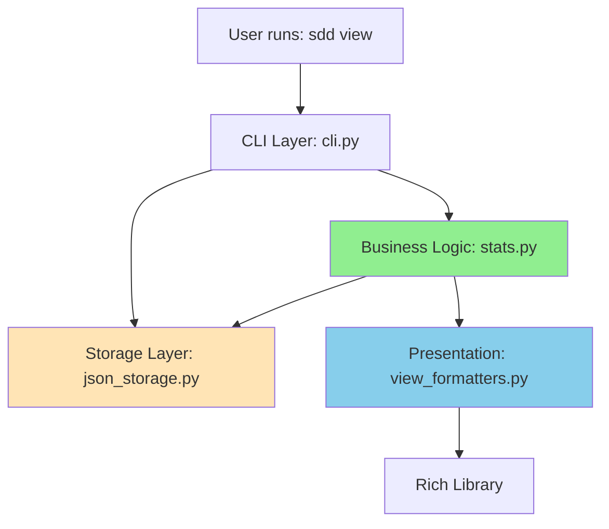
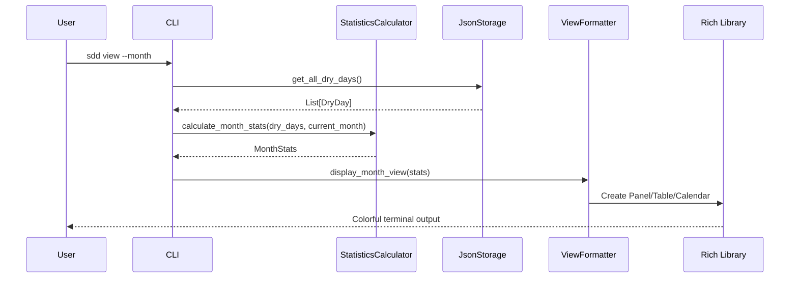

# Design Document: View Dry Days

## Overview

The "View Dry Days" feature adds visualization and statistics capabilities to the SDD Dry Days application. It transforms the existing dry day data into meaningful visual representations across multiple time periods (week, month, 30/60/90 days, custom ranges).

This feature builds entirely on the existing "Add Dry Days" infrastructure, reusing the Storage layer, DryDay model, and Rich-based UI components. The design focuses on creating a read-only statistics and visualization layer that integrates seamlessly with the existing CLI.

## Steering Document Alignment

### Technical Standards (tech.md)
- **Rich Library**: Leverages Rich for all visualizations (Tables, Panels, Progress Bars, Calendar)
- **Storage Abstraction**: Uses existing JsonStorage through the Storage interface (read-only operations)
- **Python 3.8+**: Uses standard library features (datetime, typing)
- **Performance**: Designed for <200ms response time with efficient data access patterns
- **Testing**: Will include unit tests for statistics logic and integration tests for CLI commands

### Project Structure (structure.md)
- **Module Organization**: New `stats.py` in `core/` for business logic, extend `formatters.py` in `ui/` for presentation
- **Naming Conventions**: Classes in PascalCase (`StatisticsCalculator`), functions in snake_case (`calculate_period_stats`)
- **Separation of Concerns**: Statistics calculation (core) separate from visualization (ui) separate from CLI routing
- **Repository Pattern**: Works through Storage interface, never accesses JSON files directly

## Code Reuse Analysis

This feature heavily leverages existing components to minimize new code and maximize consistency.

### Existing Components to Leverage

1. **JsonStorage** (`storage/json_storage.py`)
   - **Methods to use**:
     - `get_dry_days_in_range(start, end)` - PRIMARY method for retrieving dry days for specific periods (more efficient than get_all + filter)
     - `get_all_dry_days()` - ONLY for list view with no date filter
   - **Why**: Already implements efficient data retrieval with proper error handling. Using range queries avoids loading unnecessary data.

2. **DryDay Model** (`core/dry_day.py`)
   - **Fields to use**: `date`, `note`, `is_planned` for display and filtering
   - **Why**: Complete data model with serialization, no modifications needed

3. **StreakCalculator** (`core/streak.py`)
   - **Methods to use**: `calculate_current_streak(dry_days)` - can be adapted for period-specific streak calculations
   - **Extend**: ADD `calculate_longest_streak_in_period(dry_days, start_date, end_date)` method to existing StreakCalculator class in `core/streak.py` (NOT a separate file)
   - **Why**: Already handles consecutive day logic, can reuse algorithm. Keeps all streak logic centralized.

4. **OutputFormatter** (`ui/formatters.py`)
   - **Existing methods**: Uses Rich Console, Panel, Text for styled output
   - **Relationship with ViewFormatter**: ViewFormatter will use COMPOSITION (not inheritance) - it will have an OutputFormatter instance as a dependency for basic formatting operations (error panels, success messages)
   - **ViewFormatter adds**: New methods for tables, progress bars, calendar grids specific to view commands
   - **Why**: Consistent visual style across all commands, separation of concerns

5. **CLI** (`cli.py`)
   - **Existing pattern**: Argparse with subcommands, follows `_handle_command()` pattern
   - **Extend**: Add "view" subparser with options (--week, --month, --stats, --range, --sort, --filter)
   - **Why**: Consistent command structure

6. **DateParser** (`utils/date_parser.py`)
   - **Methods to use**: `parse(date_str)`, `generate_date_range(start, end)`
   - **Why**: Handles multiple date formats, validates dates

### Integration Points

1. **CLI → Storage**: View command will instantiate CLI, which has JsonStorage instance
2. **CLI → Statistics**: View handlers will call StatisticsCalculator methods
3. **Statistics → Storage**: StatisticsCalculator receives dry days from Storage
4. **CLI → View Formatters**: View handlers will call ViewFormatter methods for display
5. **View Formatters → OutputFormatter**: ViewFormatter extends/uses OutputFormatter patterns

## Architecture

The design follows the existing four-layer architecture:



### Data Flow



## Components and Interfaces

### Component 1: StatisticsCalculator (New)

- **Purpose:** Calculate statistics for different time periods (week, month, 30/60/90 days, custom range)
- **File:** `src/sdd_dry_days/core/stats.py`
- **Interfaces:**
  ```python
  class StatisticsCalculator:
      @staticmethod
      def calculate_period_stats(
          dry_days: List[DryDay],
          start_date: datetime,
          end_date: datetime
      ) -> PeriodStats

      @staticmethod
      def calculate_longest_streak_in_period(
          dry_days: List[DryDay],
          start_date: datetime,
          end_date: datetime
      ) -> int

      @staticmethod
      def get_week_dates(ref_date: datetime) -> Tuple[datetime, datetime]

      @staticmethod
      def get_month_dates(ref_date: datetime) -> Tuple[datetime, datetime]
  ```
- **Dependencies:** datetime, List from typing, DryDay model
- **Reuses:** StreakCalculator algorithm for consecutive day logic

### Component 2: PeriodStats Data Class (New)

- **Purpose:** Data structure to hold statistics for a time period
- **File:** `src/sdd_dry_days/core/stats.py`
- **Structure:**
  ```python
  @dataclass
  class PeriodStats:
      start_date: datetime
      end_date: datetime
      total_days: int  # Total days in period
      dry_days_count: int  # Number of dry days
      percentage: float  # (dry_days_count / total_days) * 100
      longest_streak: int  # Longest consecutive streak in period
      dry_day_dates: List[datetime]  # Actual dry day dates
      available_days: int  # Actual days with recorded data
      requested_days: int  # Requested days for the period (for AC-4.7 limited data indicator)
  ```
- **Dependencies:** dataclass, datetime, List
- **Reuses:** Similar pattern to DryDay model

### Component 3: ViewFormatter (New)

- **Purpose:** Format and display statistics using Rich library
- **File:** `src/sdd_dry_days/ui/view_formatters.py`
- **Interfaces:**
  ```python
  class ViewFormatter:
      def __init__(self, console: Console, output_formatter: OutputFormatter)

      def display_list_view(self, dry_days: List[DryDay], current_streak: int, page_size: int = 50)
      def display_week_view(self, stats: PeriodStats, week_days: List[Tuple[str, datetime, bool]])
      def display_month_view(self, stats: PeriodStats, calendar_grid: List[List[Optional[int]]])
      def display_stats_view(self, stats_30: PeriodStats, stats_60: PeriodStats, stats_90: PeriodStats, current_streak: int)
      def display_range_view(self, stats: PeriodStats, dry_days: List[DryDay])

      def create_progress_bar(self, percentage: float, width: int = 20) -> str
      def create_stats_table(self, rows: List[Tuple]) -> Table
      def create_calendar_grid(self, month_stats: PeriodStats) -> str
      def _paginate_output(self, items: List[Any], page_size: int = 50) -> Generator
  ```
- **Dependencies:** Rich (Console, Table, Panel, Text, Progress), datetime, List, OutputFormatter
- **Reuses:** OutputFormatter via composition for error panels and basic formatting

#### Pagination Implementation (AC-1.5)

For lists with more than 50 entries, pagination is implemented as follows:

```python
def display_list_view(self, dry_days: List[DryDay], current_streak: int, page_size: int = 50):
    """Display list view with pagination for large datasets."""
    total_entries = len(dry_days)

    # Display header first
    self._display_list_header(total_entries, current_streak)

    # Paginate if needed
    if total_entries > page_size:
        for page_num, page_items in enumerate(self._paginate_output(dry_days, page_size)):
            self._display_page(page_items)

            # Prompt for more (except on last page)
            if (page_num + 1) * page_size < total_entries:
                try:
                    input("\n[Press ENTER for more, Ctrl+C to stop]")
                except KeyboardInterrupt:
                    self.console.print("\n[yellow]Display stopped by user[/yellow]")
                    break
    else:
        # Show all at once if <= 50 entries
        self._display_page(dry_days)

def _paginate_output(self, items: List[Any], page_size: int = 50) -> Generator:
    """Generator to yield pages of items."""
    for i in range(0, len(items), page_size):
        yield items[i:i + page_size]
```

**User Experience:**
- First 50 entries displayed immediately
- Prompt: `[Press ENTER for more, Ctrl+C to stop]`
- User presses ENTER → next 50 entries displayed
- User presses Ctrl+C → pagination stops with "Display stopped by user" message
- On last page → no prompt (automatic end)

### Component 4: CLI View Handlers (Extend Existing)

- **Purpose:** Handle view subcommand and route to appropriate display logic
- **File:** `src/sdd_dry_days/cli.py` (extend existing CLI class)
- **Interfaces:**
  ```python
  class CLI:
      # Existing methods...

      def _handle_view(self, args)
      def _view_list(self, sort_order: str = "desc", filter_type: Optional[str] = None)
      def _view_week(self)
      def _view_month(self)
      def _view_stats(self)
      def _view_range(self, start_str: str, end_str: str)
      def _apply_sort(self, dry_days: List[DryDay], order: str) -> List[DryDay]
      def _apply_filter(self, dry_days: List[DryDay], filter_type: str) -> List[DryDay]
  ```
- **Dependencies:** StatisticsCalculator, ViewFormatter, Storage, StreakCalculator
- **Reuses:** Existing CLI patterns (_handle_add pattern, error handling, argparse setup)

#### Sort and Filter Implementation (AC-8.1-8.5)

**Sorting Logic:**
```python
def _apply_sort(self, dry_days: List[DryDay], order: str = "desc") -> List[DryDay]:
    """Sort dry days by date.

    Args:
        dry_days: List of DryDay instances
        order: "desc" (newest first, default) or "asc" (oldest first)

    Returns:
        Sorted list of DryDay instances
    """
    reverse = (order == "desc")
    return sorted(dry_days, key=lambda dd: dd.date, reverse=reverse)
```

**Filtering Logic:**
```python
def _apply_filter(self, dry_days: List[DryDay], filter_type: Optional[str]) -> List[DryDay]:
    """Filter dry days by type.

    Args:
        dry_days: List of DryDay instances
        filter_type: "planned" (future only), "actual" (past/today only), or None (all)

    Returns:
        Filtered list of DryDay instances
    """
    if filter_type is None:
        return dry_days

    today = datetime.now().date()

    if filter_type == "planned":
        return [dd for dd in dry_days if dd.date.date() > today]
    elif filter_type == "actual":
        return [dd for dd in dry_days if dd.date.date() <= today]
    else:
        raise ValueError(f"Invalid filter type: {filter_type}")
```

**Application Order (AC-8.5):**
```python
def _view_list(self, sort_order: str = "desc", filter_type: Optional[str] = None):
    """Display list view with optional sorting and filtering."""
    # 1. Fetch all dry days
    dry_days = self.storage.get_all_dry_days()

    # 2. Apply filter FIRST (reduces dataset)
    if filter_type:
        dry_days = self._apply_filter(dry_days, filter_type)

    # 3. Apply sort SECOND (on filtered dataset)
    dry_days = self._apply_sort(dry_days, sort_order)

    # 4. Display
    current_streak = self.streak_calculator.calculate_current_streak(dry_days)
    self.view_formatter.display_list_view(dry_days, current_streak)
```

**CLI Argument Setup:**
```python
# In _setup_parsers() method:
view_parser = subparsers.add_parser("view", help="View dry days and statistics")
view_parser.add_argument("--sort", choices=["asc", "desc"], default="desc",
                         help="Sort order (desc=newest first, asc=oldest first)")
view_parser.add_argument("--filter", choices=["planned", "actual"],
                         help="Filter by type (planned=future, actual=past/today)")
view_parser.add_argument("--week", action="store_true", help="Show current week")
view_parser.add_argument("--month", action="store_true", help="Show current month")
view_parser.add_argument("--stats", action="store_true", help="Show 30/60/90 day stats")
view_parser.add_argument("--range", nargs=2, metavar=("START", "END"),
                         help="Show custom date range")
```

## Data Models

### Existing Models (No Changes)

**DryDay** (from `core/dry_day.py`) - Already complete
```python
@dataclass
class DryDay:
    date: datetime
    note: str = ""
    added_at: datetime = None
    is_planned: bool = False
```

### New Models

**PeriodStats** (new in `core/stats.py`)
```python
@dataclass
class PeriodStats:
    start_date: datetime        # Start of period (inclusive)
    end_date: datetime          # End of period (inclusive)
    total_days: int             # Total days in period
    dry_days_count: int         # Number of dry days
    percentage: float           # (dry_days_count / total_days) × 100
    longest_streak: int         # Longest consecutive streak in period
    dry_day_dates: List[datetime]  # Actual dry day dates (for display)
    available_days: int         # Actual days with recorded data (for AC-4.7)
    requested_days: int         # Requested days for the period (for limited data indicator)
```

## Error Handling

### Error Scenarios

1. **No Data Available**
   - **Handling:** Check if `get_all_dry_days()` returns empty list
   - **User Impact:** Display encouraging message: "No dry days yet! Start your journey with: sdd add"
   - **Implementation:** In each `_view_*` method, check list length before processing

2. **Invalid Date Range**
   - **Handling:** Validate that end_date >= start_date before calling `get_dry_days_in_range()`
   - **User Impact:** Display error panel: "Invalid range: end date must be after start date" with examples
   - **Implementation:** In `_view_range()`, validate before calling DateParser

3. **Storage Errors**
   - **Handling:** Catch exceptions from Storage methods (FileNotFoundError, PermissionError, JSONDecodeError)
   - **User Impact:** Display specific error messages based on exception type
   - **Implementation:** Try-except blocks in `_handle_view()` method

4. **Insufficient Data**
   - **Handling:** When calculating 90-day stats but only 30 days of data exist, calculate based on available data
   - **User Impact:** Display indicator: "(limited data: 30/90 days)"
   - **Implementation:** In `calculate_period_stats()`, check actual data range vs requested range

## Implementation Details

### Statistics Calculation Algorithm

**Calculate Period Stats:**
```python
def calculate_period_stats(
    dry_days: List[DryDay],
    start_date: datetime,
    end_date: datetime,
    all_recorded_days: Optional[List[DryDay]] = None
) -> PeriodStats:
    """Calculate statistics for a time period.

    Args:
        dry_days: All dry days (for filtering)
        start_date: Period start (inclusive)
        end_date: Period end (inclusive)
        all_recorded_days: All recorded days (for limited data indicator, AC-4.7)

    Returns:
        PeriodStats with all metrics including limited data indicators
    """
    # 1. Filter dry days to period
    period_dry_days = [dd for dd in dry_days
                       if start_date.date() <= dd.date.date() <= end_date.date()]

    # 2. Calculate requested days in period
    requested_days = (end_date.date() - start_date.date()).days + 1

    # 3. Calculate available days (for AC-4.7 limited data indicator)
    if all_recorded_days:
        earliest_record = min(dd.date for dd in all_recorded_days)
        available_start = max(start_date, earliest_record)
        available_days = (end_date.date() - available_start.date()).days + 1
        available_days = max(0, min(available_days, requested_days))
    else:
        available_days = requested_days  # Assume full data if not specified

    # 4. Count dry days
    dry_days_count = len(period_dry_days)

    # 5. Calculate percentage (use requested_days as denominator)
    percentage = (dry_days_count / requested_days * 100) if requested_days > 0 else 0.0

    # 6. Calculate longest streak
    longest_streak = calculate_longest_streak_in_period(period_dry_days, start_date, end_date)

    # 7. Extract dates
    dry_day_dates = [dd.date for dd in period_dry_days]

    return PeriodStats(
        start_date=start_date,
        end_date=end_date,
        total_days=requested_days,
        dry_days_count=dry_days_count,
        percentage=percentage,
        longest_streak=longest_streak,
        dry_day_dates=dry_day_dates,
        available_days=available_days,
        requested_days=requested_days
    )
```

**Limited Data Indicator Display (AC-4.7):**
```python
# In ViewFormatter.display_stats_view():
for period, stats in [("30d", stats_30), ("60d", stats_60), ("90d", stats_90)]:
    # Show limited data indicator if available_days < requested_days
    if stats.available_days < stats.requested_days:
        period_display = f"{period} [dim](limited data: {stats.available_days}/{stats.requested_days} days)[/dim]"
    else:
        period_display = period

    table.add_row(period_display, str(stats.dry_days_count), ...)
```

**Calculate Longest Streak in Period:**
```python
def calculate_longest_streak_in_period(dry_days: List[DryDay], start_date: datetime, end_date: datetime) -> int:
    if not dry_days:
        return 0

    # Sort by date
    sorted_days = sorted(dry_days, key=lambda d: d.date)

    max_streak = 1
    current_streak = 1

    for i in range(1, len(sorted_days)):
        # Check if consecutive
        if (sorted_days[i].date - sorted_days[i-1].date).days == 1:
            current_streak += 1
            max_streak = max(max_streak, current_streak)
        else:
            current_streak = 1

    return max_streak
```

### Calendar Grid Generation

```python
def create_calendar_grid(month_stats: PeriodStats) -> str:
    # 1. Get first and last day of month
    first_day = month_stats.start_date
    last_day = month_stats.end_date

    # 2. Get day of week for first day (0=Monday, 6=Sunday)
    first_weekday = first_day.weekday()

    # 3. Build grid (list of lists, 6 rows × 7 columns)
    grid = []
    current_date = first_day - timedelta(days=first_weekday)  # Start from Monday before 1st

    for week in range(6):  # Max 6 weeks in a month
        week_row = []
        for day in range(7):  # 7 days per week
            if current_date.month == first_day.month:
                day_num = current_date.day
                is_dry = current_date.date() in [d.date() for d in month_stats.dry_day_dates]
                is_today = current_date.date() == datetime.now().date()
                week_row.append((day_num, is_dry, is_today))
            else:
                week_row.append(None)  # Day outside current month
            current_date += timedelta(days=1)
        grid.append(week_row)

    # 4. Format grid as string
    return format_grid_with_rich(grid)
```

### Progress Bar Rendering

**Leverage Rich's built-in Progress components** for consistent, accessible visualization:

```python
from rich.progress import Progress, BarColumn, TextColumn

def create_progress_bar(self, percentage: float) -> str:
    """Create progress bar using Rich's Progress component.

    Args:
        percentage: Progress percentage (0-100)

    Returns:
        Rendered progress bar with percentage text (AC-9.2 compliant)
    """
    # Color based on percentage (accessible color choices)
    if percentage < 50:
        color = "red"
    elif percentage < 75:
        color = "yellow"
    else:
        color = "green"

    # Use Rich's BarColumn for consistent rendering
    # Note: For inline display in tables, use manual rendering:
    filled = int(percentage / 100 * 20)  # 20 character width
    empty = 20 - filled
    bar = "▓" * filled + "░" * empty

    # CRITICAL: Always include percentage text (AC-9.2)
    return f"[{color}]{bar}[/{color}] {percentage:.0f}%"

def display_stats_view(self, stats_30, stats_60, stats_90, current_streak):
    """Display statistics with Rich Progress bars."""
    # For table display, use inline progress bars
    table = Table(title="📈 Statistics Overview")
    table.add_column("Period", style="cyan")
    table.add_column("Dry Days", justify="center")
    table.add_column("Total Days", justify="center")
    table.add_column("Progress", justify="left")

    # Add rows with progress bars
    for period, stats in [("30d", stats_30), ("60d", stats_60), ("90d", stats_90)]:
        progress_bar = self.create_progress_bar(stats.percentage)
        table.add_row(
            period,
            str(stats.dry_days_count),
            str(stats.total_days),
            progress_bar
        )

    self.console.print(table)
```

**Benefits of using Rich components:**
- Consistent rendering across terminal types
- Automatic handling of terminal width constraints
- Built-in accessibility features (respects NO_COLOR)
- Progress bars degrade gracefully in non-color terminals

## Testing Strategy

### Unit Testing

**Test File:** `tests/unit/test_stats.py`
- Test `calculate_period_stats()` with various date ranges
- Test `calculate_longest_streak_in_period()` with gaps and consecutive days
- Test `get_week_dates()` returns correct Monday-Sunday range
- Test `get_month_dates()` returns correct 1st-last day
- Test edge cases: empty lists, single day, boundary dates

**Test File:** `tests/unit/test_view_formatters.py`
- Test `create_progress_bar()` with different percentages
- Test `create_calendar_grid()` with different months
- Test table formatting methods
- Mock Rich Console to verify correct method calls

**Coverage Target:** >90% for stats.py, >80% for view_formatters.py

### Integration Testing

**Test File:** `tests/integration/test_view_cli.py`
- Test `sdd view` with sample data
- Test `sdd view --week` displays correct week
- Test `sdd view --month` displays correct month
- Test `sdd view --stats` displays 30/60/90 day stats
- Test `sdd view --range START END` with valid range
- Test error handling (no data, invalid range, corrupted file)
- Test sorting (--sort asc/desc)
- Test filtering (--filter planned/actual)
- Use tmp_path fixture for isolated storage
- Mock OutputFormatter to capture output

**Coverage Target:** >80% for view command handlers in cli.py

### End-to-End Testing

**Manual Test Scenarios:**
1. Fresh install (no data) → view command shows encouraging message
2. Add several dry days → view shows correct list
3. Add dry days across multiple weeks → week view shows correct breakdown
4. Add dry days across multiple months → month view shows calendar
5. Add 100+ dry days → stats view shows 30/60/90 day statistics
6. Custom range (1 week, 1 month, 1 year) → range view shows correct stats
7. Large dataset (1000+ entries) → verify <200ms response time

## Performance Considerations

### Data Access Patterns

1. **Efficient Filtering**: Use list comprehensions for filtering, not loops
   ```python
   # Good
   period_days = [dd for dd in dry_days if start <= dd.date <= end]

   # Avoid
   period_days = []
   for dd in dry_days:
       if start <= dd.date <= end:
           period_days.append(dd)
   ```

2. **Single Data Fetch**: Call `get_all_dry_days()` once, filter in memory
   - For week/month/stats views, fetch all days once
   - Filter to specific periods in Python (faster than multiple storage calls)

3. **Lazy Rendering**: For large lists, consider pagination or limiting display
   - Only render first 50 entries by default
   - Provide "[Press ENTER for more]" prompt for additional entries

### Memory Optimization

1. **Generator Expressions**: For very large datasets, use generators
   ```python
   dry_dates_set = {dd.date.date() for dd in dry_days}  # Set for O(1) lookup
   ```

2. **Avoid Copying**: Pass references to lists, don't copy unnecessarily
   - `calculate_period_stats()` doesn't modify input list
   - Filter creates new list but doesn't copy DryDay objects

### Measurement Points

- Time `get_all_dry_days()` call
- Time statistics calculation
- Time Rich rendering
- Total time from command to first output

Target: <200ms total for datasets up to 1000 entries

## Security and Privacy

### Read-Only Operations

All view commands are read-only:
- Never call `add_dry_day()`, `update_dry_day()`, or `_write_data()`
- Only use `get_*()` methods from Storage interface
- No side effects on data files

### Error Message Safety

- Don't expose file paths in error messages (use "~/.sdd_dry_days/" not full path)
- Don't show stack traces to users (catch exceptions, show friendly errors)
- Don't log or transmit data externally

### Data Validation

- Validate date ranges before processing (prevent overflow attacks)
- Limit output size (prevent memory exhaustion with paginated lists)
- Handle corrupted data gracefully (don't crash, show error)

## Accessibility Implementation (AC-9.1-9.5)

This section addresses WCAG 2.1 AA compliance and screen reader support for terminal output.

### Dual Encoding (AC-9.1, AC-9.4)

**Never rely on color alone.** All information is conveyed through BOTH color AND text/symbols:

```python
# Status Indicators
DRY_DAY_SYMBOL = "✓"        # Green + checkmark
NOT_DRY_SYMBOL = "-"        # Red + dash
PLANNED_SYMBOL = "✓(P)"     # Yellow + checkmark with (P)
TODAY_MARKER = "*"          # Bold + asterisk

# Example implementation in ViewFormatter:
def format_status(self, is_dry: bool, is_planned: bool, is_today: bool) -> str:
    if is_today:
        marker = f"[bold]*[/bold]"
    else:
        marker = ""

    if is_dry and is_planned:
        return f"[yellow]{PLANNED_SYMBOL}[/yellow]{marker}"
    elif is_dry:
        return f"[green]{DRY_DAY_SYMBOL}[/green]{marker}"
    else:
        return f"[red]{NOT_DRY_SYMBOL}[/red]{marker}"
```

### Text Alongside Visual Elements (AC-9.2)

**All progress bars include percentage text:**

```python
def create_progress_bar(self, percentage: float, width: int = 20) -> str:
    """Create progress bar with text percentage (AC-9.2)."""
    filled = int(percentage / 100 * width)
    empty = width - filled

    # Color based on percentage
    if percentage < 50:
        color = "red"
    elif percentage < 75:
        color = "yellow"
    else:
        color = "green"

    # Use Unicode box characters with percentage text
    bar = "▓" * filled + "░" * empty

    # CRITICAL: Always show percentage as text
    return f"[{color}]{bar}[/{color}] {percentage:.0f}%"
```

### Contrast Ratios (AC-9.3)

**Color choices ensure WCAG 2.1 AA contrast (4.5:1 for text):**

- **Green** (`#00FF00`): High contrast on dark terminals
- **Red** (`#FF0000`): High contrast on dark terminals
- **Yellow** (`#FFFF00`): High contrast on dark terminals
- **Bold text**: Used for emphasis without relying solely on color

**Testing:** Validate colors in common terminal emulators (macOS Terminal, iTerm2, Windows Terminal, GNOME Terminal)

### Screen Reader Support (AC-9.5)

**Plain text alternatives for complex visuals:**

```python
def display_month_view(self, stats: PeriodStats, calendar_grid: List[List[Optional[int]]]):
    """Display month calendar with screen reader support."""

    # Visual calendar grid
    self._render_calendar_grid(calendar_grid)

    # Screen reader friendly summary (plain text)
    self.console.print("\n[bold]Summary for Screen Readers:[/bold]")
    self.console.print(f"Month: {stats.start_date.strftime('%B %Y')}")
    self.console.print(f"Total days: {stats.total_days}")
    self.console.print(f"Dry days: {stats.dry_days_count} ({stats.percentage:.0f}%)")
    self.console.print(f"Current streak: {stats.longest_streak} days")

    # List dry day dates for screen readers
    if stats.dry_day_dates:
        self.console.print("\nDry days in this month:")
        for date in stats.dry_day_dates:
            self.console.print(f"  - {date.strftime('%Y-%m-%d')}")
```

### Legend and Explanations

**Always provide legends for symbols:**

```python
# In month view
self.console.print("\n[dim]Legend:[/dim]")
self.console.print("[green]✓[/green]=Dry  [red]-[/red]=Not Dry  [bold]*[/bold]=Today")

# In stats view
self.console.print("\n[dim]Period abbreviations:[/dim]")
self.console.print("30d = Last 30 days, 60d = Last 60 days, 90d = Last 90 days")
```

### Keyboard Navigation

**Pagination uses standard keyboard controls:**
- ENTER: Next page (universally accessible)
- Ctrl+C: Stop/Cancel (standard terminal interrupt)
- No mouse required

**No complex keyboard shortcuts** - all interaction is linear (read top to bottom, optional pagination)

### Rich Library Accessibility Features

**Leverage Rich's built-in accessibility:**
- Rich automatically respects `NO_COLOR` environment variable
- Rich provides `legacy_windows` mode for older terminals
- Rich console can be configured with `force_terminal=False` for pure text output

```python
# In ViewFormatter.__init__():
self.console = Console(
    force_terminal=True,       # Use colors in terminal
    legacy_windows=True,       # Support older Windows terminals
    no_color=False             # Respect NO_COLOR env var
)
```

## Future Enhancements

### Phase 2 Additions (Not in Current Scope)

1. **Export Functionality**: Export views to CSV/JSON/PDF
2. **Calendar Integration**: iCal export for dry days
3. **Visualization Graphs**: Trend lines, bar charts using Rich or matplotlib
4. **Comparison Views**: Compare this week vs last week, this month vs last month
5. **Goal Integration**: Show progress toward goals in views
6. **Theming**: Customizable color schemes for output

### Extensibility Points

- `ViewFormatter` can be subclassed for alternative output formats
- `StatisticsCalculator` can be extended with new metrics (median streak, variance, etc.)
- CLI can add new view types (--year, --quarter)

## Migration Path

No data migration required - this feature is purely additive:
- Reads existing JSON data structure
- No changes to DryDay model
- No changes to storage format
- Backward compatible with existing installations

## Dependencies

### New Dependencies

None - all visualization uses existing Rich library

### Updated Dependencies

None - leverages existing dependencies (Rich, pytest, etc.)
